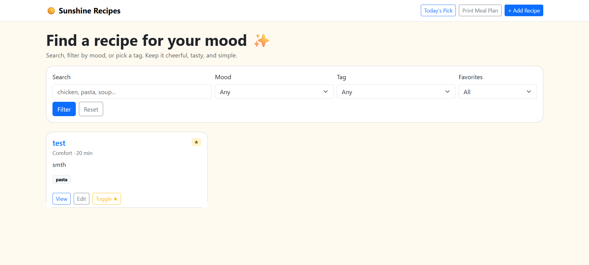
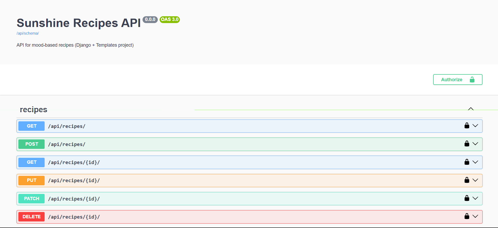
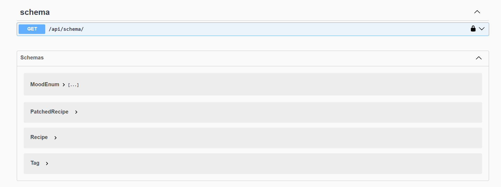
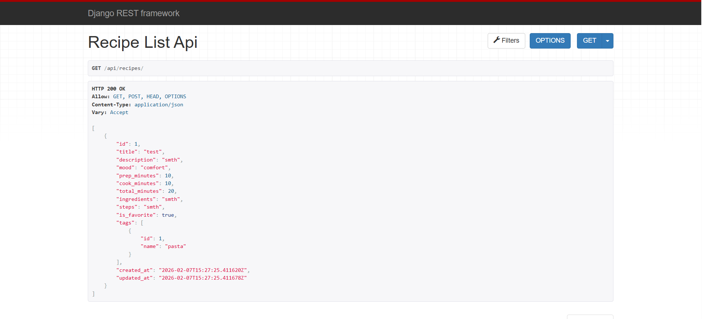

# ☀️ Sunshine Recipes

A cheerful and useful **Django web app** for managing recipes based on your mood.  
Built using **Django + Django Templates** for the frontend, and **Django REST Framework + Swagger (OpenAPI)** for API documentation.

Users can:
- Browse recipes by mood
- Search and filter by tags
- Mark favorites ⭐
- Get a “Today’s Pick”
- Print a simple weekly meal plan
- Access a documented REST API (Swagger UI)

---

## ✨ Features

### 🌐 Web App (Django Templates)
- Recipe list with search & filters
- Mood-based filtering (Comfort, Energizing, Quick, etc.)
- Tags for recipes
- Favorites toggle ⭐
- Today’s Pick (random recipe)
- Print-friendly weekly meal plan
- Create / Edit / Delete recipes

### REST API (DRF)
- List & create recipes
- Retrieve, update, delete recipes
- Search & ordering
- Fully documented with Swagger (OpenAPI 3)

### Swagger / OpenAPI
- Interactive API docs
- Try endpoints directly from the browser

---

## 🖼️ Screenshots

### Homepage (Django Templates)


### Swagger UI (OpenAPI)



### DRF Browsable API



---

## 🛠️ Tech Stack

- Python 3.x  
- Django  
- Django Templates (Frontend)  
- Django REST Framework  
- drf-spectacular (Swagger / OpenAPI)  
- SQLite (default DB)  
- Bootstrap (via CDN)

---

## 🚀 Getting Started

### 1️⃣ Clone the repo
```bash
git clone https://github.com/FatMansour/sunshine_recipes.git
cd sunshine_recipes
